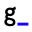

#  My Portfolio Website

A little space to showcase my works during spare time. Thanks for visiting!

:link: [Link to my portfolio website.](https://bicheng-g.github.io)

**To Do**:

**My Modifications**:
- [x] Setup Google Analytics and Google Tag Manager tracking.
- [x] Added favicon for browser tab icon.
- [x] Fixed background image to prevent black strip.
- [x] Added search bar with React.
- [x] Added content filter based on search query with JavaScript.
- [x] Utilized github api to populate 'recent works'.
- [x] Added typewriter text effect to the header

**Credit**:
* HTML5UP for the website skeleton.
* CODMYUI for the search bar inspiration.
